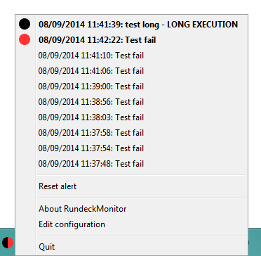

# RundeckMonitor

System tray icon tools that indicates failed rundeck jobs and jobs running for a too long time.

***

## Installation

Download the latest jar release at this URL: https://github.com/Sylvain-Bugat/RundeckMonitor/releases

## Launch and configuration

Just execute this jar file: `rundeck-monitor-1.3-SNAPSHOT-jar-with-dependencies.jar`.

And if no configuration file is found, a basic configuration wizard is launched.

After configuration, the tray icon can be in these colors:

| color | description |
| ---------- | ---------- |
|  | no failed jobs has failed since the launch or the last alert reset and no long execution is detected |
|  | a new failed job is detected since the launch or the last alert reset |
|  | a job is running for too long |
|  | a new failed job is detected since the launch or the last alert reset and another job is running for too long |
|  | the connection with rundeck is lost |

When the tray icon is marqued with red, this alert can be reset to get back to green/black.

Failed and long  jobs list can be clicked in order to see the rundeck execution detail. This is done by opening a default browser tab/window with the execution URL.

***

## Manual/custom configuration

Edit the configuration file creatd by the wizard or copy and edit the sample configuration file `rundeckMonitor.properties` from the master `target\` directory and change these parameters:  

### Rundeck project parameters

	rundeck.monitor.url=
	
URL with the http protocol and with only the domain and the port like: `http:\\rundeck.domain.com:4444`

	rundeck.monitor.project=
	
Rundeck project containing jobs to scan

### Authentication parameters

	rundeck.monitor.api.key=

Rundeck API key can be used instead of login/password

	rundeck.monitor.login=
	
Login with access to the Rundeck REST API if no API key is defined

	rundeck.monitor.password=
	
Password associated with this login if no API key is defined

## Additionnal Configuration

These parameters in the `rundeckMonitor.properties` file can also be changed:

	rundeck.monitor.name=Rundeck monitor
	
Set the name of the application

	rundeck.monitor.refresh.delay=60
	
Delay between 2 scans of failed jobs(unit: seconds)

	rundeck.monitor.execution.late.threshold=1800
	
Delay after a running jobs is flagged as late(unit: seconds)

	rundeck.monitor.failed.job.number=10
	
Number of failed jobs to see in the popup menu

	rundeck.monitor.date.format=dd/MM/yyyy HH:mm:ss
	
Date format of the failed jobs in the popup menu

	rundeck.monitor.api.version=10

Optional rundeck rest API version to use (11 cannot be used yet because of https://github.com/rundeck/rundeck-api-java-client/pull/12)

***

## Compile and build

Clone the master repository with this command:

	git clone https://github.com/Sylvain-Bugat/RundeckMonitor.git

Build target jars with this command:

	mvn clean install

